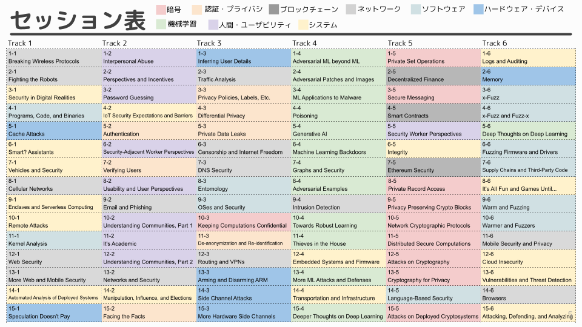

## **Usenix Security 2023の全論文422本を2時間で紹介する会**
- 日時：2023年9月1日（金） 14:00 - 16:00
- 場所：JR池袋駅徒歩圏（参加連絡を頂いた方に個別連絡いたします）
- 話者：大畑幸矢（Byerlis Inc.）
- 詳細：参加費無料、配信なし、定員49名（先着順）
- 概要：2023年8月に開催される国際会議Usenix Security 2023に関して、全体傾向や採録論文を一通り紹介する。

<!--
参加をご希望の方は氏名と所属を明記の上、bss at byerlis dot jpまでご連絡ください。  
皆様のご参加をお待ちしております。
-->

(2023/9/3追記)　セミナーは盛況のうちに終了いたしました。

